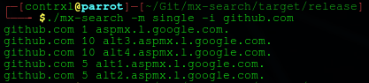
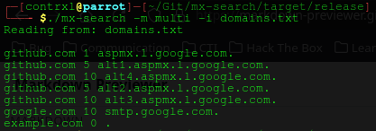
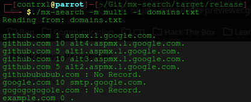
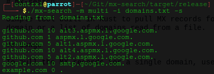

# mx-search

Simple tool built in Rust to pull MX records for a domain or a list of domains read from a file. 

## Usage - Single Mode

To pull the MX records for a single domain, use:

```bash
./mx-search -m single -i [URL]
```

### Example

```bash
./mx-search -m single -i github.com
```



## Usage - Multi Mode

This lets you check MX records for a list of domains in a `.txt` file. Each domain must be on its own line. To pull the MX records for multiple domains, use:

```bash
./mx-search -m multi -i [path/to/file.txt]
```

### Example

```bash
./mx-search -m multi -i domains.txt
```


## Usage - Suppressing Domains with No Record

By default, multi mode will output all results, if a domain has no MX record available, the program will return "No Record.".

```bash
./mx-search -m multi -i domains.txt
```



This behaviour can be changed by adding the `-s` flag:

```bash
./mx-search -m multi -i domains.txt -s
```

This will not show any output if a domain in the list contains no MX records.

